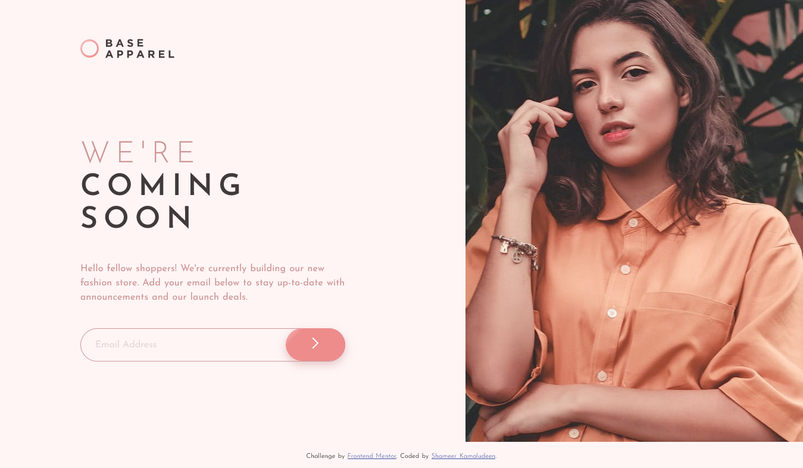

# Frontend Mentor - Base Apparel coming soon page solution

This is a solution to the [Base Apparel coming soon page challenge on Frontend Mentor](https://www.frontendmentor.io/challenges/base-apparel-coming-soon-page-5d46b47f8db8a7063f9331a0). Frontend Mentor challenges help you improve your coding skills by building realistic projects. 

## Table of contents

- [Overview](#overview)
  - [The challenge](#the-challenge)
  - [Screenshot](#screenshot)
  - [Links](#links)
- [My process](#my-process)
  - [Built with](#built-with)
  - [What I learned](#what-i-learned)
  - [Continued development](#continued-development)
  - [Useful resources](#useful-resources)
- [Author](#author)
- [Acknowledgments](#acknowledgments)

## Overview

The challenge helped me familiarize some javascript, CSS grid and flex also client-side form validation and Constraint Validation API. As these are the things used to make the solution for the challenge.

### The challenge

Users should be able to:

- View the optimal layout for the site depending on their device's screen size
- See hover states for all interactive elements on the page
- Receive an error message when the `form` is submitted if:
  - The `input` field is empty
  - The email address is not formatted correctly

### Screenshot

### Links

- Solution URL: [Click here](https://github.com/shameerkamaludeen/base-apparel-coming-soon)
- Live Site URL: [Click here](https://shameerkamaludeen.github.io/base-apparel-coming-soon/)

## My process

### Built with

- Semantic HTML5 markup
- Flexbox
- CSS Grid
- Client-side form validation
- Constraint Validation API
- Mobile-first workflow

### What I learned

The following are the things learned from this challenge:

- Familiarized with CSS flexbox and grid, got to know more properties of these.
- Familiarized with using client-side validation and constraint validation API
- Familiarized using the form.

### Continued development

Client-side validation, constraint validation API and form are needs to be used on more occasions to get used to these things to improve the frontend skills.

### Useful resources

- [Client-side form validation](https://developer.mozilla.org/en-US/docs/Learn/Forms/Form_validation).
- [Flexbox](https://developer.mozilla.org/en-US/docs/Learn/CSS/CSS_layout/Flexbox)
- [Grids](https://developer.mozilla.org/en-US/docs/Learn/CSS/CSS_layout/Grids)

## Author

- Github - [Shameer Kamaludeen](https://github.com/shameerkamaludeen)
- Frontend Mentor - [@shameerkamaludeen](https://www.frontendmentor.io/profile/shameerkamaludeen)

## Acknowledgments

Frontend mentor doing a good job providing such a platform to improve the skill required in frontend development, I am really thankful for them as each of their challenges gives me new ideas and things to learn. 
